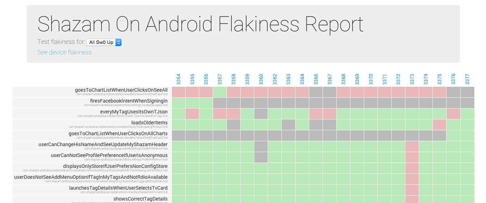
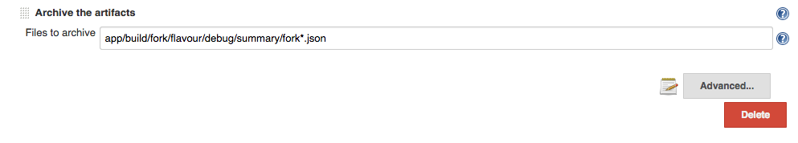
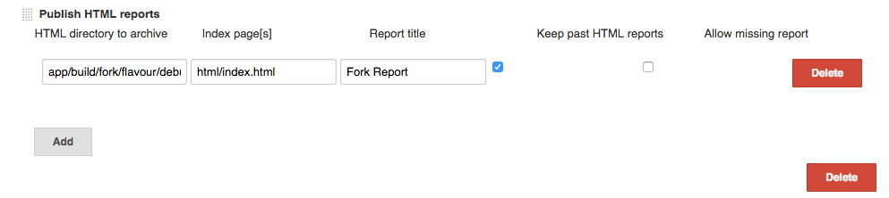
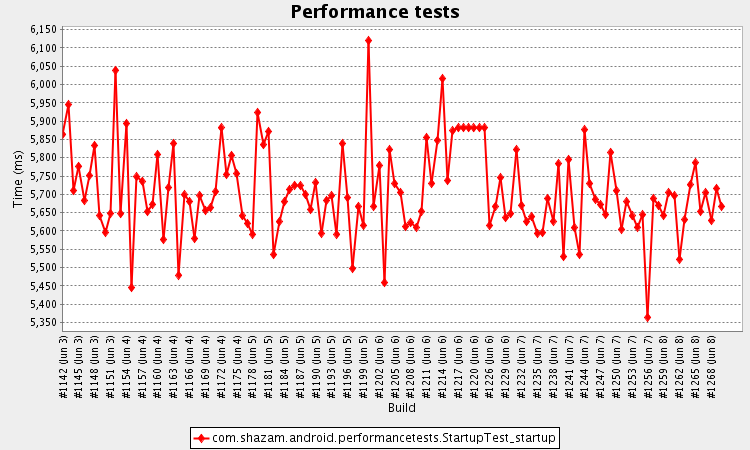

[](https://travis-ci.org/shazam/fork)  [](https://www.codacy.com/app/i-giannakakis/fork?utm_source=github.com&amp;utm_medium=referral&amp;utm_content=shazam/fork&amp;utm_campaign=Badge_Grade)

Fork tools
==========
The Fork project consists of these tools:

* [**Fork**](#fork) offers the fastest way to execute Android instrumentation test suites.
* [**Flakiness Reporter**](#flakiness-reporter) produces readable reports about test flakiness on tests suites previously executed by Fork.
* [**Chimprunner**](#chimprunner) runs performance tests and keeps stats and standard reports (Systrace, memory, CPU, etc).

# Fork
When running instrumentation tests, there is a significant time overhead for developers, especially on larger test suites. Existing solutions were not satisfactory for quick feedback before pushing code to VCS and for CI purposes.

We are big fans of [Spoon][1] and were using it for our plans, so we used it as our starting point. However, Spoon had similar issues to the Gradle and Maven test execution plugins, in the sense that it executes all tests on all of the connected devices (and emulators). We decided to tweak that naive scheduling to achieve much faster test execution.


## How it works
We introduced the notion of *pools of devices*. These are now responsible for running a test suite instead of each device running the suite separately. That has two side effects: 
* infinite scaling: your tests can speed up by as many devices and emulators as you can dedicate to your CI box. 
* because test suites now get scheduled to run on a pool, not all tests will run on all devices. For that reason, we also introduced a way to create a pool per device, which offers full coverage (a.k.a. Spoon-mode) but typically takes longer, so we run it on a nightly basis.
Fork works out-of-the-box, without any code changes.


## Running Fork
There are two ways to run Fork with your builds.

### Gradle plugin (recommended)
First, you need to add a build-script dependency. You can have access to snapshot builds, but stable versions are recommended.
#### Stable
```
buildscript {
  dependencies {
    classpath 'com.shazam.fork:fork-gradle-plugin:2.0.0'
  }
}
```
#### Snapshot
```
buildscript {
  repositories {
    // other repos ...
    maven { url 'https://oss.sonatype.org/content/repositories/snapshots' }
  }
  dependencies {
    classpath 'com.shazam.fork:fork-gradle-plugin:2.1.0-SNAPSHOT'
  }
}
```

Apply the Fork plugin
```
apply plugin: 'com.shazam.fork'
```

You're now done. If you had any instrumentation test tasks before, the plugin has added Fork tasks. You can verify by running:

```
gradlew tasks | grep fork
```

You can use Fork's DSL to configure its execution parameters. For a full list of the properties, have a look at: [**Configuring pools and runtime**](#configuring-pools-and-runtime) and related [**Examples**](#examples). It should be as easy as adding a block to your build.gradle:

```groovy
fork {
    title "My Fork report"
    isCoverageEnabled true
}
```

### Standalone
Check out the Fork project and execute:

```
> gradlew fork-runner:run -Pargs='ARGUMENTS LIST'

Available options (* mandatory).         
    --sdk                       Path to Android SDK. Defaults to the ANDROID_HOME environment variable.
    --apk (*)                   Path to application.
    --test-apk (*)              Path to test application.
    --config (*)                Location of the configuration file. 
```
The properties of the configuration file are described in:  [**Configuring pools and runtime**](#configuring-pools-and-runtime) and related [**Examples**](#examples).

## Configuring pools and runtime
One of the most useful characteristics of the library is the way it creates the device pools. There are different options, to automatically create pools by API level, shortest width dimension and whether devices are self-described as tablets. On top of that, users can also manually create pools based on serial numbers, for maximum flexibility.

With either way of executing Fork ([**Gradle**](#gradle-plugin-recommended) / [**Standalone**](#standalone)) you can specify how the pools are created by setting a combination of the properties below. You can also find  [**examples**](#examples):

Property Name          | Property Type           | Default value
---------------------- | ----------------------- | -------------
baseOutputDir          | File                    | "fork"
ignoreFailures         | boolean                 | false
isCoverageEnabled      | boolean                 | false
testClassRegex         | String                  | "^((?!Abstract).)*Test$"
testPackage            | String                  | (Your instrumentation APK package)
title                  | String                  | -
subtitle               | String                  | -
testOutputTimeout      | int                     | 60000
testSize               | String                  | -
excludedSerials        | Collection&lt;String&gt;| -
fallbackToScreenshots  | boolean                 | false
totalAllowedRetryQuota | int                     | 0
retryPerTestCaseQuota  | int                     | 1
autoGrantPermissions   | boolean                 | true
restartAdbIfNoDevices  | boolean                 | false
poolingStrategy        | PoolingStrategy         | -

`Poolingstrategy` is an object that describes how the device pools are created. You can choose **only one** strategy from below:

Property Name          | Property Type       | Description |
---------------------- | ------------------- | -------------
splitTablets           | boolean             | configure pools depending on their manufacturer's 'tablet' flag (ro.build.characteristics)
eachDevice             | boolean             | create a pool per device (a.k.a. Spoon-mode). This is the default behaviour.
manual                 | ManualPooling       | configure pools manually, per serial number
computed               | ComputedPooling     | configure pools automatically, by setting device criteria (API level, shortest width dimension)

`ManualPooling`'s properties are:

Property Name          | Property Type                               | Description |
---------------------- | ------------------------------------------- | -------------
groupings              | Map&lt;String, Collection&lt;String&gt;&gt; | map pool names to collection of device serials to be assigned to that pool

`ComputedPooling`'s properties are:

Property Name          | Property Type              | Description |
---------------------- | -------------------------- | -------------
characteristic         | Characteristic             | Possible values: "sw"\|"api" (shortest width or API level)
groups                 | Map&lt;String, Integer&gt; | map the name of a pool to their lowest dimension for a characteristic

## Examples

###Gradle plugin examples
####Automatic pooling
A common case can be that you want to create two pools, one for phones & small tablets (7" and below) and one for large tablets. You could add to your `build.gradle` file:
```groovy
fork {
    title "Fork report"
    subtitle "automatically split phones to large tablets"
    poolingStrategy {
	    computed {
		    characteristic = "sw"
		    groups {
			    phablets = 0
			    tablets = 720
			}
	    }
    }
}
```
The above will run tests on 2 pools, one named "phablets" and another called "tablets". The smallest width for the first pool will be 0 and for the latter 720 dpi.

####Manual pooling
```groovy
fork {
    title "Fork report"
    subtitle "manually allocated devices"
    poolingStrategy {
	    manual {
		    groupings {
			    phablets = ["ABCDE", "FGHIJ"]
			    tablets = ["12345"]
			}
	    }
    }
}
```
That will create two pools named "phablets" & "tablets" with devices that have the respective serial numbers.

###Standalone examples
####Automatic pooling
Execute the following:
```
> gradlew fork-runner:run -Pargs='--apk /path/to/production.APK --test-apk /path/to/test.APK --config /path/to/fork-config.json'
```
Where the contents of `fork-config.json` are:
```
{
	"title" : "Fork Report",
	"subtitle" : "automatically split phones to tablets",
	"poolingStrategy" : {
		"computed" : {
			"characteristic" : "sw",
			"groups" : {
				"phablets" : 0,
				"tablets" : 720
			}
		}
	}
}
```

####Manual pooling
Execute the following:
```
> gradlew fork-runner:run -Pargs='--apk /path/to/production.APK --test-apk /path/to/test.APK --config /path/to/fork-config.json'
```
Where the contents of `fork-config.json` are:
```
{
    "title" : "Fork Report",
    "subtitle" : "manually allocated devices",
    "poolingStrategy" : {
        "manual" : {
            "phablets" : ["ABCDE", "FGHIJ"],
            "tablets" : ["12345"]
        }
    }
}
```

## Limitations
 * The scheduling still works on a single build box with ADB, so there still is a limit by how many devices & emulators can be simultaneously connected to ADB. Eventually, Fork could be tweaked to talk over HTTP with other build agents, that would then be connected to devices over ADB. That model would tie in nicely with multi-agent CI systems, like Jenkins.

# Flakiness Reporter
One common problem with UI tests is the test flakiness from either the environment they run on or badly written tests. To help track down tests that are misbehaving, we introduced the Flakiness reporter.

The reports produced by the Flakiness Reporter eventually make it trivial to find flaky tests and link to them and their diagnostics. Currently Jenkins is supported and it should be really easy to extend it to other types of CI servers.

## How it works
The Flakiness Reporter collects Fork output files, matches test runs over previous builds and sorts them according to their flakiness. Links are also created to each test of each test run, for easy navigation to diagnostics.

## Sample output
The output after a successful run of the Flakiness Reporter looks like the following:


## Running the Flakiness Reporter (Jenkins)
The Gradle plugin that allows the Reporter to run can be applied to a standalone project, since it doesn't directly depend on your Android project. For convenience, however, that is a good compromise.

Currently, the Reporter supports Jenkins but plugins can be written to be used with other CI servers.

To be able to use the Flakiness Reporter add these dependencies:
```
buildscript {
    dependencies {
        classpath "com.shazam.fork:fork-reporter-jenkins-gradle-plugin:2.1.0-SNAPSHOT"
    }
    repositories {
        maven { url "http://repo.jenkins-ci.org/public/" }
    }
}
```

Apply the Jenkins Flakiness Reporter plugin
```
apply plugin: 'com.shazam.fork.reporter.jenkins'
```

You can easily execute the Reporter with the following command.
```
gradlew forkJenkinsReport
```

### Gradle plugin configuration
To allow the Reporter communicate with your Jenkins server, you need to configure it with some basic details about your Jenkins Plan

Property Name          | Property Type  |  Description
---------------------- | -------------- | ---------------------------
reportTitle            | String         |  The title you want your report to have
jenkinsUrl             | String         |  The base URL of your Jenkins Server
jenkinsJobName         | String         |  The name of the job you want to be tracked
jenkinsReportTitle     | String         |  Optional, used to link to Fork diagnostics. [The report title you use to archive Fork's report folder](#publish-forks-html-report)

An example of a configuration:
```groovy
forkJenkins {
    reportTitle = "My project's awesome flakiness report"
    jenkinsUrl = "http://my-jenkins.server.net:8080/"
    jenkinsJobName = "Master"
    jenkinsReportTitle = "Fork Report"
 }
```

### Jenkins configuration
In your post-build action section in Jenkins, do the following two actions.

#### Archive Fork's summary file as an artifact
The Reporter works with summary files from Fork runs. For them to be accessible, they need to be archived like below:


#### Publish Fork's HTML report
This requires [Jenkins's HTML Publisher Plugin][2]. To be able to link to the right test runs, use a clear title.


**Note:** The [forkJenkins.jenkinsReportTitle](#gradle-plugin-configuration) parameter of the gradle configuration has to match the Report Title added here.

# Chimprunner
At the time of writing, not much is available around automated performance testing. Chimprunner is a very simple test runner that allows recording of somewhat accurate timings on test execution, from process creation to test finish. It all works on the Android instrumentation tests system that developers are familiar with.

##How to setup
```
buildscript {
    dependencies {
        classpath 'com.shazam.chimprunner:chimprunner-gradle-plugin:0.9.0-SNAPSHOT'
    }
}
```

Apply the Chimprunner plugin
```
apply plugin: 'com.shazam.chimprunner'
```

New tasks will have been added that allow you to run familiar instrumentation tests as performance tests. Verify the tasks exist with:

```
gradlew tasks | grep chimprunner
```

##Configuring Chimprunner
Configuring Chimprunner is simple. Add the following to your `build.gradle` file:
```groovy
chimprunner {
	serial "0123456"
	testPackage "com.example.performancetests"
}
```
The full list of configurable properties (* are mandatory):

Property Name          | Property Type | Default value                      | Description 
---------------------- | --------------|----------------------------------- | -------------------
baseOutputDir          | File          | "chimprunner"                      | the output folder
\* serial              | String        | -                                  | the serial of the device where the performance tests will be executed
ignoreFailures         | boolean       | false                              | whether failures of the performance tests should fail the build
testClassRegex         | String        | "^((?!Abstract).)*Test$"           | classes that will be searched for tests
\* testPackage         | String        | (Your instrumentation APK package) | the package where the performance tests are located  

##Current reports
Currently, Chimprunner produces a `timings.csv` file in the output folder with all the timings of tests that were executed as part of the performance tests and the average time they took after running a number of iterations. That CSV file can be then used for plotting by other tools. Using the Jenkins Plot plugin we can now produce historic diagrams of our startup time like the following diagram:


##Future work
We would like to add ways of automatically launching Android performance tools & reports developers know and use already, with no or minimal code changes. We will investigate around how to provide systrace, CPU, GPU & memory usage reports. The library will probably provide some annotations that will enable various performance tools. An example could be:
```java
@Test
@Systrace
@Gpu
public void trackListScroll() {
	//...
}

@Test
@Timings(iterations=10)
public void startUpSpeed() {
    //...
}
```
The system could then provide a systrace & GPU profiling reports for the duration of the `trackListScroll()` test.

#License

    Copyright 2016 Shazam Entertainment Limited.

    Licensed under the Apache License, Version 2.0 (the "License"); you may not use this file except in compliance with the License.

    You may obtain a copy of the License at http://www.apache.org/licenses/LICENSE-2.0

    Unless required by applicable law or agreed to in writing, software distributed under the License is distributed on an "AS IS" BASIS, WITHOUT WARRANTIES OR CONDITIONS OF ANY KIND, either express or implied. See the License for the specific language governing permissions and limitations under the License.


 [1]: https://github.com/square/spoon
 [2]: https://wiki.jenkins-ci.org/display/JENKINS/HTML+Publisher+Plugin

